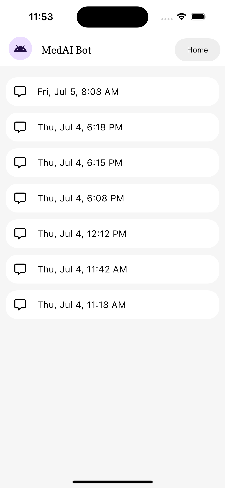
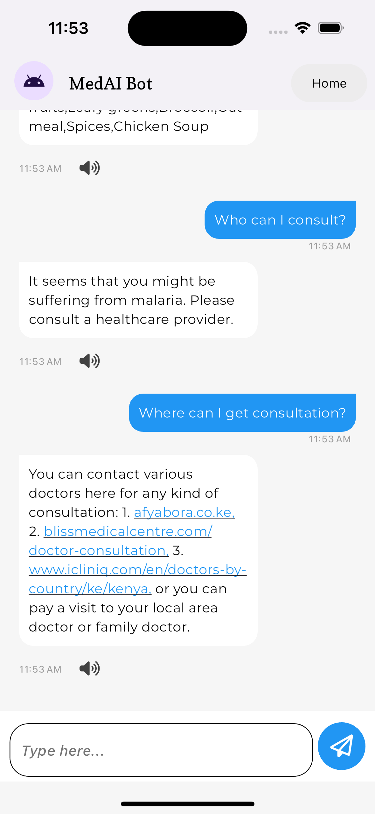
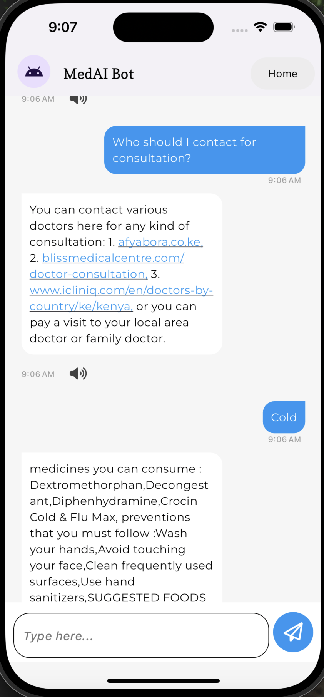

# MedAI: An NLP iOS-based Medical Chatbot

## Overview

MedAI is an advanced medical chatbot application designed for iOS devices. It leverages Natural Language Processing (NLP) to provide users with reliable medical advice based on their inputs. The project is developed using Flutter for the frontend and Django for the backend. Our NLP model is a feed-forward neural network trained to understand and respond to various medical-related intents.

## Features

- **NLP-based Medical Advice**: Provides users with accurate medical advice through intent recognition.
- **User-friendly Interface**: Developed using Flutter to ensure a smooth and intuitive user experience.
- **Robust Backend**: Powered by Django to handle requests efficiently and securely.
- **Real-time Chat**: Seamlessly integrates with the backend to offer real-time responses.

## Getting Started

### Prerequisites

- Flutter SDK
- Dart
- Python 3.x
- Django
- iOS device or simulator
- Xcode (for iOS development)

### Installation

#### Backend Setup

1. **Clone the Repository**

   ```bash

   git clone https://github.com/your-username/medai-backend.git
   cd medai-backend
   
   ```

2. **Create a Virtual Environment**
   
   ```bash

   python3 -m venv env
   source env/bin/activate

   ```
   
3. **Install Dependencies**

  ```bash

  pip install -r requirements.txt

  ```

4. **Run Migrations**

   ```bash

   python manage.py migrate

   ```

5. **Start the Django Server**

   ```bash

   python manage.py runserver

   ```

#### Frontend Setup

1. **Clone the Repository**

   ```bash

   git clone https://github.com/your-username/medai-frontend.git
   cd medai-frontend

   ```

2. **Install Flutter Dependencies**

   ```bash

   flutter pub get

   ```

3. **Run the App on iOS Simulator**
 
   ```bash

   flutter run

   ```

## Usage

1. **Launch the App**: Open the MedAI app on your iOS device or simulator.
2. **Start a Conversation**: Begin typing your medical query in the chat interface.
3. **Receive Advice**: The chatbot will analyze your input and provide relevant medical advice.
4. **Follow your Chat History**: Resume from where you last left off with MedAI Chatbot.

## Contributing

We welcome contributions to enhance MedAI. Please follow these steps:

1. Fork the repository.
2. Create a new branch ('git checkout -b feature-branch').
3. Commit your changes ('git commit -am 'Add new feature').
4. Push to the branch ('git push origin feature-branch').
5. Create a new Pull Request.

## Screenshots

Home Screen             |  Chat History Screen
:-------------------------:|:-------------------------:
 |  

Chat Interface Screen           |  Chat Interface with clickable links
:---------------------------------:|:-------------------------:
  |  

---

Thank you.